# Sprint 1

## **Instal·lació SO Ubuntu 24**

#####Aqui posarem el nom, el tipus de SO i la versió que volem.
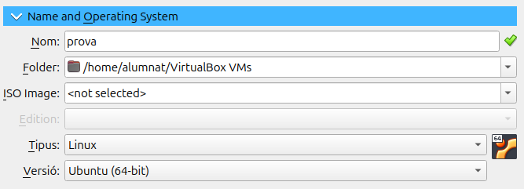

#####Posem la memòria que creiem necesaria.
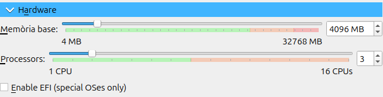

#####Podem ampliar la capacitat de la nostra màquina si volem.
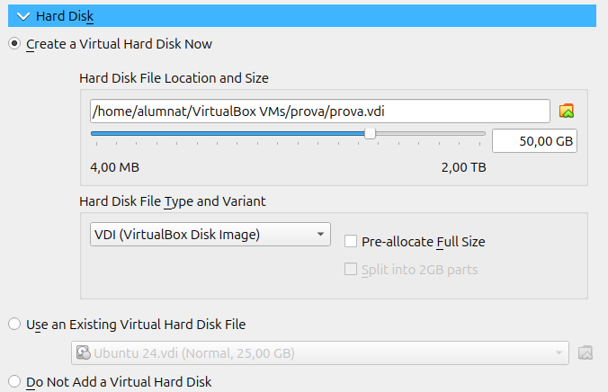

#####Una vegada dintre fiquem la ISO de ubuntu desktop 24.
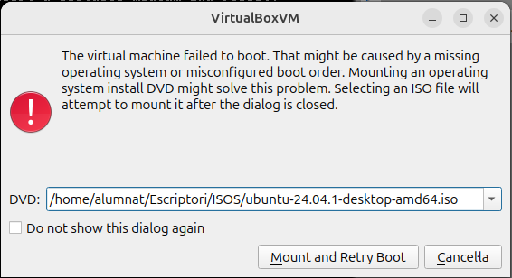

#####Cliquem a instal·lar ubuntu.

#####Seguidament triarem les opcions personals que més ens agradi o s'ajustin a nosaltres.
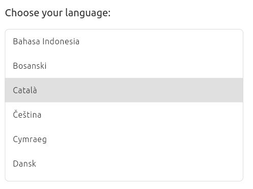

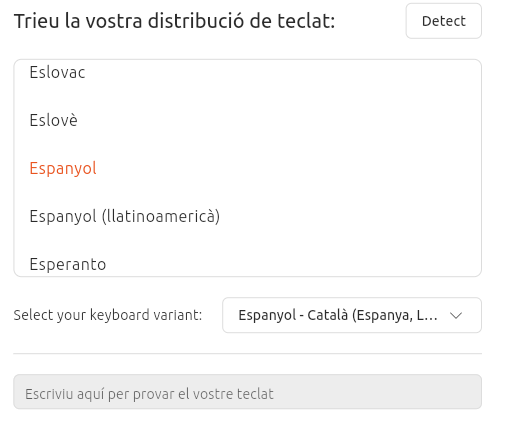

#####Instal·lem el sistema d'ubuntu.
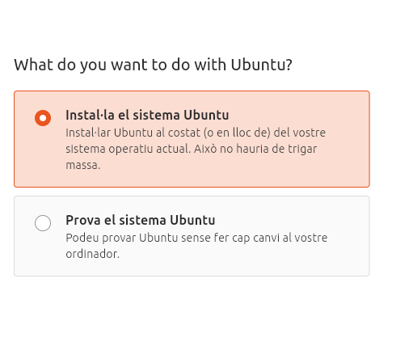

#####Volem que sigui una instal·lació interactiva.
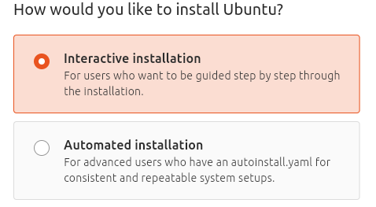

#####Desisió personal (recomano la predeterminada).

#####Ara per a fer les particions que volem cliquem a alguna altra cosa.

#####Ara creem una nova partició.

#####Li donem la memoria que volem tindre perque esta sera una partició swap, que es la particio per a tindre un extra de RAM per a la instalació. 

#####Per a la partició Home li posarem l'espai per les nostres homes o usuaris varia segons el que volem.

#####I per acabar amb les particions la root que li donarem la memoria restan.

#####Aqui es pot observar com quedara.
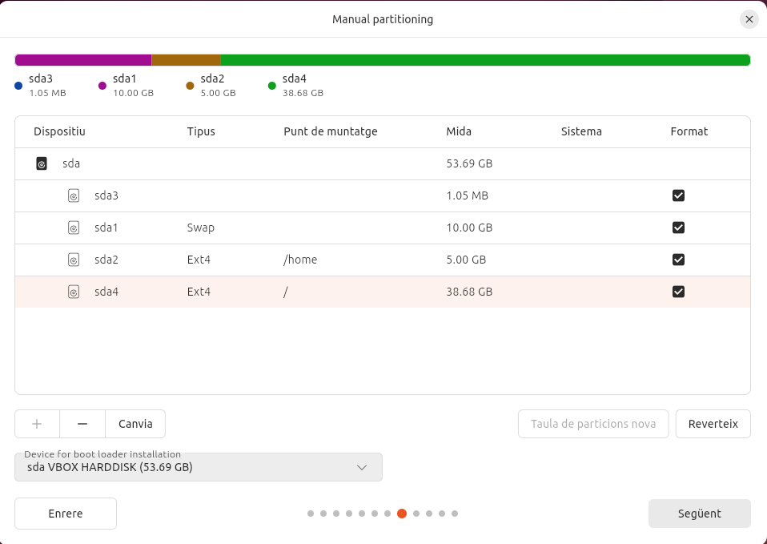

#####Comprovem que ho tenim tot en ordre.
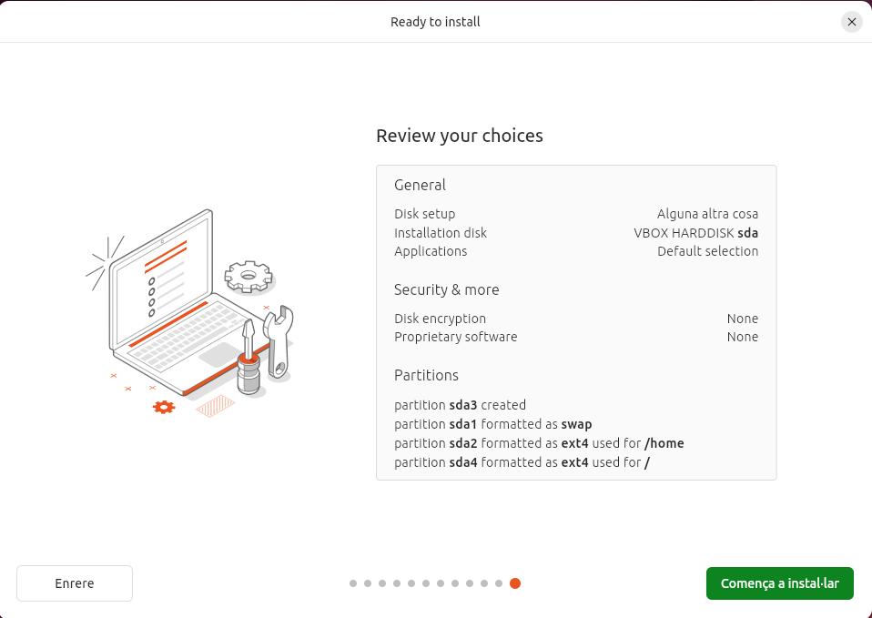

#####I ja tendries la teva màquina d'ubuntu 24 Desktop amb particions fetes!!
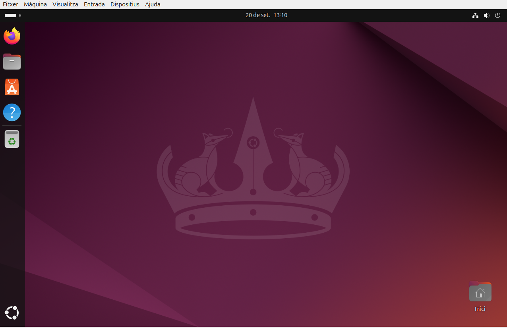

## Configuració xarxa

#####per a començar la nostra màquina tindra Xarxa NAT.

#####Si activem el DHCP no haurem de canviar res.

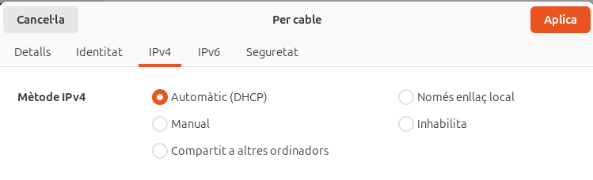

#####I si volem manual haurem de posar la configuració de xarxa.

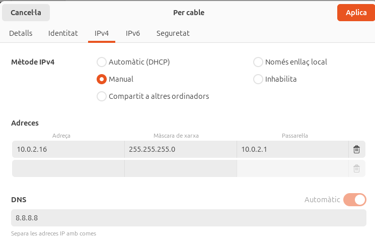

#####Per a comprobar que s'ha canviat fem ip a i mirem la ip que sigui la correcta.

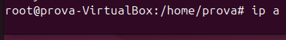

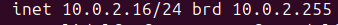

#####I ara per canviar-ho manualment entrarem al netplan.

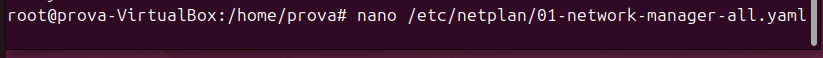

#####El canviarem per a que quedi així.

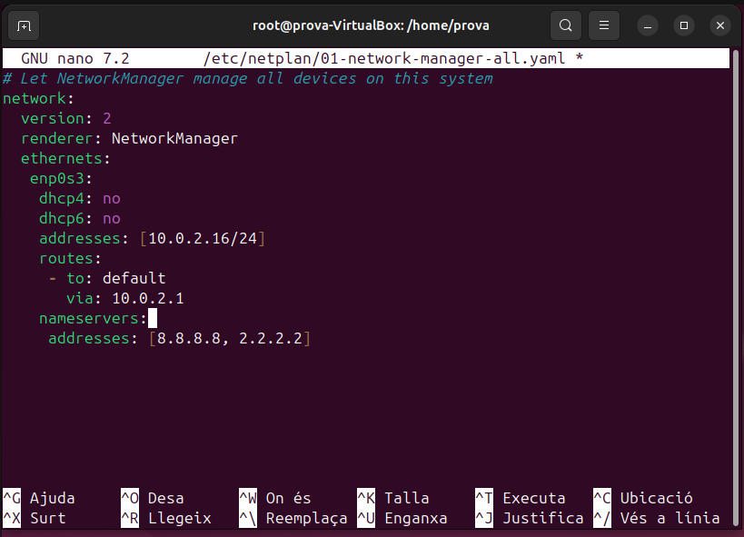

#####Farem un netplan apply per a guardar.

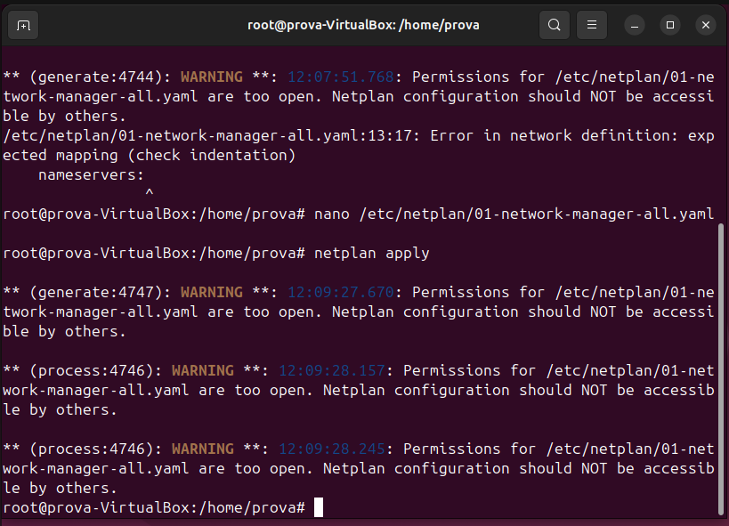

#####Farem ping per a comprovar que tot funcioni.

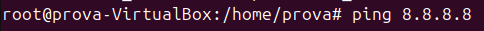

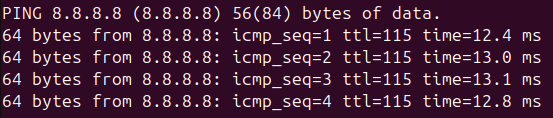

## Punts de restauració

#####Instal·lem el timeshift

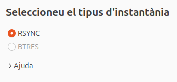

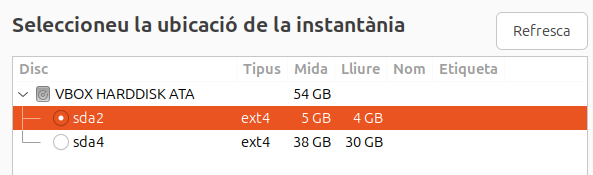

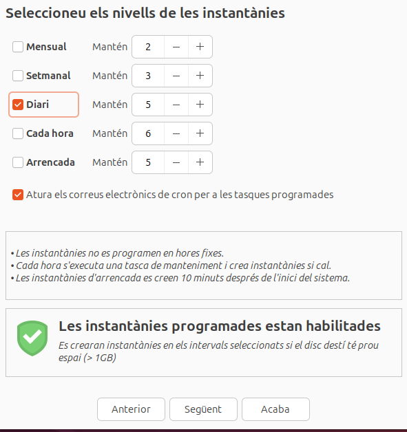

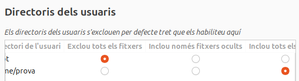

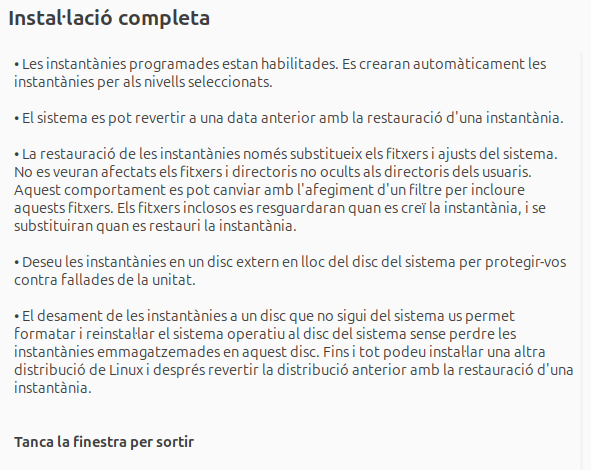
###### Ara que ja tenim el timeshift instal·lat clicarem a fer la instantània al botò de crear.
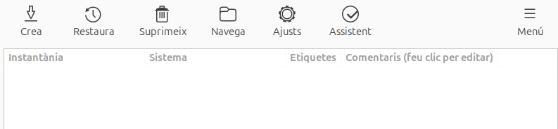

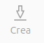

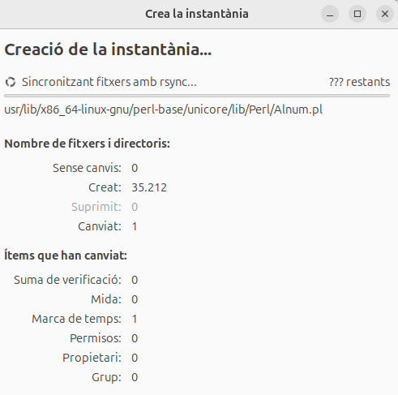

## GRUB

##### Mirem que tenim grub
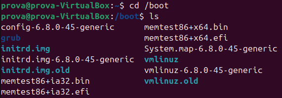
##### Eliminem la grub 
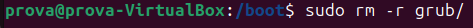
##### Mirem que no tenim grub
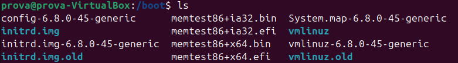
##### Anirem a parametres 
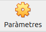
##### En l'apartat de emmagatzematje

##### Obrim des de una nova ISO 

##### Entrem a la màquina 

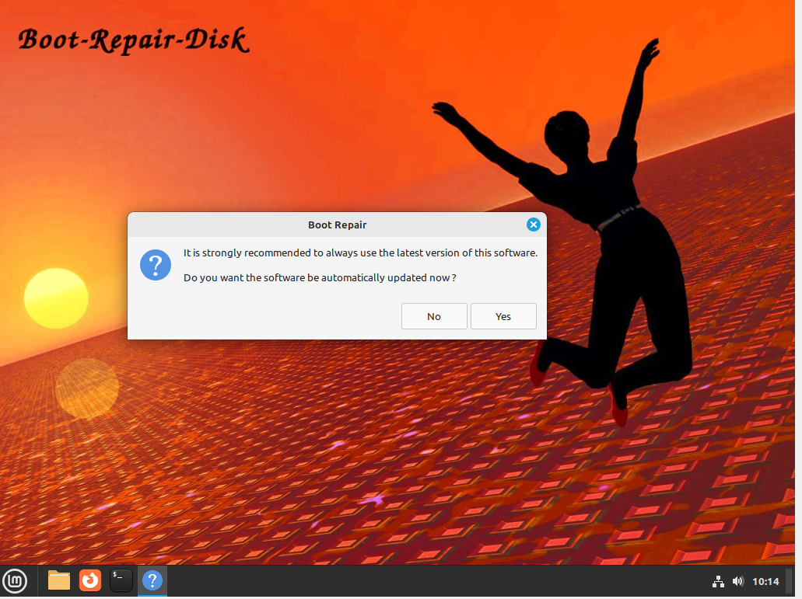
##### Iniciarem la reparació recomanada.
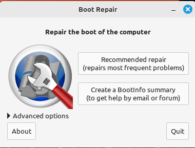
##### Una vegada reparada ja podriem tancar la maquina i tornar a obrir-la.
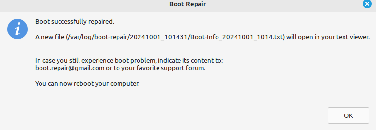

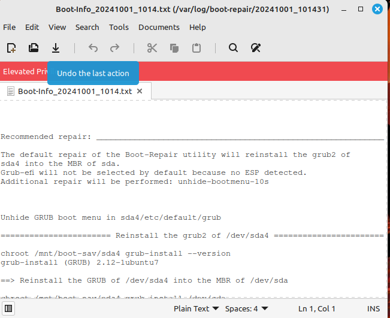
##### Obrim la màquina normal 

##### I al entrar a la carpeta boot podem veure que s'ha creat la grub.

##### La tornem a borrar

##### Tornem a posar desde parametres l'altra ISO de recuperació de GRUB.
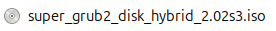
##### Al obrir ens mostrara aquesta pantalla, seleccionarem Arranque manual. 

##### Anem a Sistemas Operativos
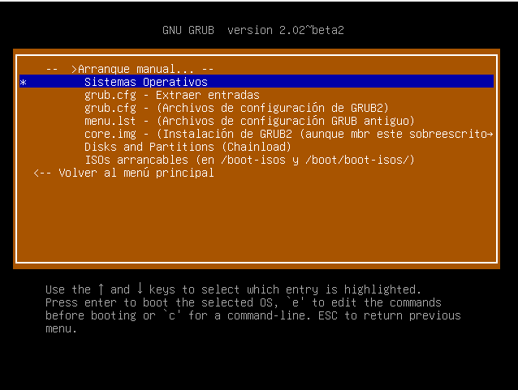
##### Seleccionem Linux 
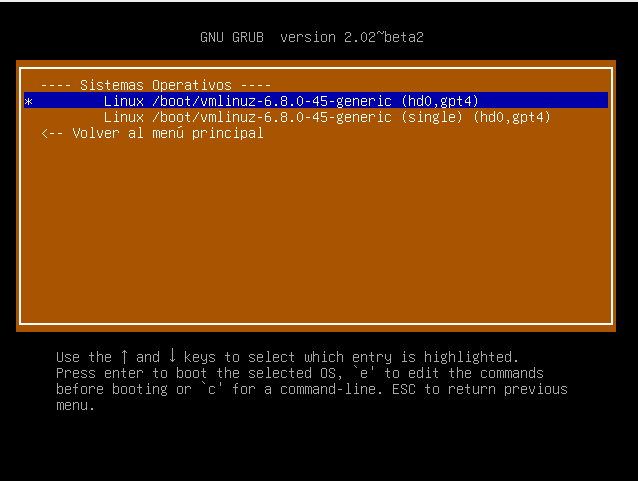
##### Ara tanquem la maquina i tornem a obrir treient la ISO I deixant l'apartat d'emmagatzematje buit.

##### Al entrar entrarem al directori boot.
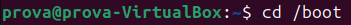
##### Posarem les comandes per tornar a instal·lar la GRUB.

##### Fem una update a la GRUB per acaba de recuperar-la.
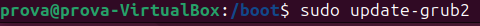
##### Ara fem un ls i ja la tindrem.
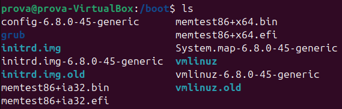

## Instalació virtual d'aplicacións

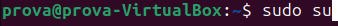

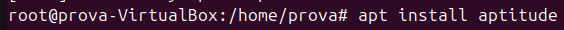

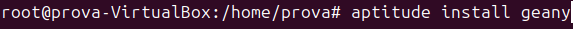

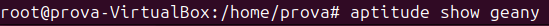

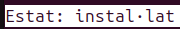

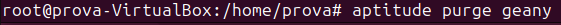

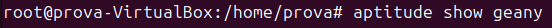

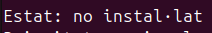

